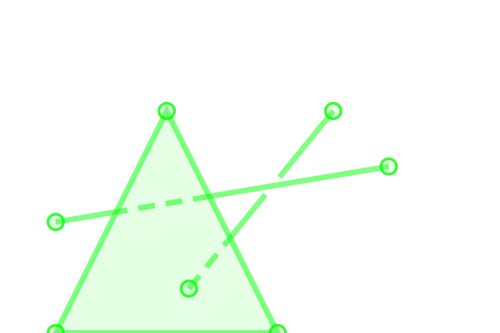
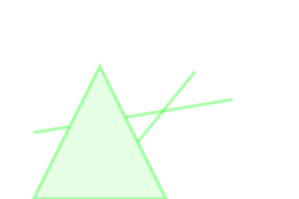

# Finite Reconstruction Problem {background-image="chaya.png" background-opacity="0.05" background-size="100% 100%"}

## The Talk in a Nutshell {style="font-size: 0.7em"}

```{ojs}
//| panel: sidebar
viewof n = Inputs.range([0, 500], { label: "Sample Size", value: 150, step: 1 })
viewof tol = Inputs.range([0, 100], { label: "Noise", value: 20, step: 1 })
viewof scaleB = Inputs.range([0, 150], {
  step: 0.5,
  value: 0,
  label: tex`r_{\mathcal S}`
});
viewof scaleA = Inputs.range([0, 150], {
  step: 0.5,
  value: 0,
  label: tex`r_{\mathcal G}`
})
viewof scale = Inputs.range([0, 300], {
  step: 1,
  value: 0,
  label: tex`\beta`
})
viewof showShape = Inputs.toggle({ label: tex`{\mathcal G}`, value: false })
viewof showSample = Inputs.toggle({ label: tex`{\mathcal S}`, value: false })
viewof showRips = Inputs.toggle({ label: 'Euclidean Vietoris–Rips', value: false })
```

```{ojs}
import { slider } from "@jashkenas/inputs"
{
  const svg = d3
    .create("svg")
    .attr("class", "canvas")
    .style("margin-left", "15px")
    .style("width", "100%")
    .style("height", height);

  if(showShape) {
    svg
      .append("path")
      .attr("class", "shape")
      .attr("stroke", "#3be57f")
      .attr("stroke-width", "2")
      .attr("fill", "none")
      .attr("d", d3.line()(X));
  }

  if(showSample) {
    svg
      .selectAll(".vertex")
      .data(S)
      .join("circle")
      .attr("class", "vertex")
      .attr("fill", "#bb473f")
      .attr("cx", (d) => d[0])
      .attr("cy", (d) => d[1])
      .attr("r", "3px");
  }
  if(scaleA > 0 || scaleB > 0)
    drawBalls(svg, X, S, scaleA, scaleB); 
  if(showRips)
    drawRips(svg, rips(S, scale));
  
  return svg.node();
}
rips = function (sample, scale) {
	const simplices=[d3.range(sample.length),[],[]];
	const adjRips = new Array(sample.length);
	const dEps = new Array(sample.length);
	
	for(var i = 0; i < adjRips.length; i++) {
	    adjRips[i]= new Array(sample.length);
	    
	    for(var j = 0; j < adjRips.length; j++) {
		  var d = dist2(sample[i],sample[j]); 
		  if( d < scale) {
		    adjRips[i][j]=d;
		    if(i<j)
    	 		simplices[1].push([i,j]);
		  }
		  else
		    adjRips[i][j]=0;
	    }
	}
	combinations(simplices[0],3).forEach(function(d) {
    	    if ( diam2( d3.permute(sample,d) ) < scale )
    		simplices[2].push(d);
  });
  return simplices;
}

X = lissajous(center, 0, center[0] - 70, center[1] - 50, 3, 2, 2000)
S = lissajous(center, tol, center[0] - 70, center[1] - 50, 3, 2, n)
center = [height / 2 + 100, height / 2]
height = 500
lissajous = function (
  center,
  tol = 5,
  a = center[0] - 100,
  b = center[1] - 50,
  kx = 3,
  ky = 2,
  n = 300
) {
  var t = d3.range(n).map(function (d) {
    return (2 * Math.PI * d) / (n - 1);
  });
  var points = [];
  for (var i = 0; i < n; i++) {
    points[i] = [
      center[0] +
        a * Math.cos(kx * t[i]) +
        d3.randomUniform(tol)() * Math.cos(d3.randomUniform(2 * Math.PI)()),
      center[1] +
        b * Math.sin(ky * t[i]) +
        d3.randomUniform(tol)() * Math.sin(d3.randomUniform(2 * Math.PI)())
    ];
  }
  return points;
}
function dist2(a, b) {
  if (a.length != b.length || a.length != 2) return null;
  return Math.sqrt(Math.pow(a[0] - b[0], 2) + Math.pow(a[1] - b[1], 2));
}
function diam2(points) {
  var diam = 0;
  points.forEach(function (p) {
    points.forEach(function (q) {
      diam = Math.max(diam, dist2(p, q));
    });
  });
  return diam;
}
function combinations(set, k) {
    var i, j, combs, head, tailcombs;
    if (k > set.length || k <= 0) {
	return [];
    }
    if (k == set.length) {
	return [set];
    }
    if (k == 1) {
	combs = [];
	for (i = 0; i < set.length; i++) {
	    combs.push([set[i]]);
	}
	return combs;
    }
    combs = [];
    for (i = 0; i < set.length - k + 1; i++) {
	head = set.slice(i, i + 1);
	tailcombs = combinations(set.slice(i + 1), k - 1);
	for (j = 0; j < tailcombs.length; j++) {
	    combs.push(head.concat(tailcombs[j]));
	}
    }
    return combs
}
drawBalls = function (svg, X, S, scaleA, scaleB) {
  svg
    .selectAll(".A-ball")
    .data(X)
    .join("circle")
    .attr("class", "A-ball")
    .attr("cx", (d) => d[0])
    .attr("cy", (d) => d[1])
    .attr("r", scaleA)
    .attr("fill", "#3be57f")
    .attr("stroke", "none")
    .attr("opacity", "0.1");
  svg
    .selectAll(".B-ball")
    .data(S)
    .join("circle")
    .attr("class", "B-ball")
    .attr("cx", (d) => d[0])
    .attr("cy", (d) => d[1])
    .attr("r", scaleB)
    .attr("fill", "#bb473f")
    .attr("stroke", "none")
    .attr("opacity", "0.1");
  
  return svg;
}
drawRips = function (svg, simplices) {

  if (simplices[2]) {
    svg.selectAll(".triangle")
      .data(simplices[2])
      .join("path")
      .attr("class", "triangle")
      .attr("d", (d) => d3.line()(d.map((v) => S[v])))
      .attr("fill", "#bb473f")
      .attr("stroke", "none")
      .attr("opacity", "0.1");
  }
  if (simplices[1]) {
    svg.selectAll(".edge")
      .data(simplices[1])
      .join("path")
      .attr("class", "edge")
      .attr("d", (d) => d3.line()(d.map((v) => S[v])))
      .attr("stroke", "#bb473f").attr("stroke-width", "1.5");
  }
  return svg;
}
```

## 

- <green>**Shape**</green>: A *Shape* is modeled as a metric space $(X,d_X)$
  - <green>ex</green>: manifolds, graphs, general stratified spaces
  - <green>type</green>: abstract metric space, Euclidean embedded 

- <green>**Sample**</green>: A *finite*, metric space $(S,d_S)$
- <green>**Closeness**</green>: small <green>Gromov--Hausdorff</green> distance $d_{\mathrm GH}(X, S)$ or <green>Hausdorff</green> distance $d_{\mathrm H}(X, S)$
   
- <green>**Goal**</green>: Develop *algorithms* to recover the <green>homotopy-type</green> and <green>geometry</green> of $X$ from $S$ with guarantees.


## Reconstruction via Vietoris<green>--</green>Rips {.smaller}

::: {.columns}

:::{.column width="55%" }
- Look at sample at scale $\beta$
- Computationally efficient
- Data dimension agnostic---unlike the Čech complex or $\alpha$-complex

- Persistent homology considers all possible scales $\beta$ to make reasonable (only) <red>homological</red> inference

:::

::: {.column width="45%"}


:::

:::

. . . 

::: {.callout-note appearance="minimal"}


My goal is to provide a <green>[</green>window<green>]</green> of scales where <green>homotopy</green> properties are <green>quantitatively</green> guaranteed.

:::

## <green>Latschev's</green> Theorem {.smaller}

. . . 

:::{.callout-tip icon="false"}
## @hausmann_1995
For any closed Riemannian manifold $X$ and $0<\beta<\rho(X)$ small enough, the Vietoris--Rips complex $\mathcal{R}_\beta(X)$ is *homotopy equivalent* to $X$.
:::


- Recovering the homotopy information of $X$ is computationally <red>infeasible</red>

. . .

::: {.callout-tip icon="false"}
## @latschev_2001
Every closed Riemannian manifold $X$ has an <green>$\epsilon_0>0$</green> such that for any $0<\beta\leq\epsilon_0$ there exists some $\delta>0$ so that for any sample $S$:
$$
d_{GH}(S,X)\leq\delta\implies \mathcal R_\beta(S)\simeq X.
$$
:::

- Latschev promised feasibility but <red>qualitative</red>!


## Quantitative Latschev's Theorems {.smaller style="font-size:0.6em"}

:::{.callout-tip icon="false"}
## Metric Graph Reconstruction [*J. Appl. & Comp. Top., @Majhi2023*]
Let $(G,d_G)$ be a compact, path-connected metric graph, $(S,d_S)$ a metric space, and $\beta>0$ a number such that $$3d_{GH}(G,S)<\beta<\frac{3}{4}\rho(G).$$ 
Then, $\mathcal R_\beta(S)\simeq G$

:::


- $\epsilon_0=\frac{3}{4}\rho(G)$, $\delta=\frac{1}{3}\beta$

. . .

:::{.callout-tip icon="false"}
## Riemannian Manifold Reconstruction [*SoCG'24, DCG, @MajhiLatschev*]

Let $M$ be a closed, connected Riemannian manifold. Let $(S,d_S)$ be a compact metric space and $\beta>0$ a number such that
$$
	\frac{1}{\xi}d_{GH}(M,S)<\beta<\frac{1}{1+2\xi}\min\left\{\rho(M),\frac{\pi}{4\sqrt{\kappa}}\right\}
$$ 
for some $0<\xi\leq1/14$. Then, $\mathcal R_\beta(S)\simeq M$.

:::

- <green>For $\xi=\frac{1}{14}$</green>: $\epsilon_0=\frac{7}{8}\min\left\{\rho(M),\frac{\pi}{4\sqrt{\kappa}}\right\}$, $\delta=\frac{\beta}{14}$

## Quantitative Latschev's Theorem {.smaller}

:::{.callout-tip icon="false"}
## Euclidean Submanifold Reconstruction [@MajhiLatschev]
Let $M\subset\mathbb R^N$ be a closed, connected submanifold. Let $S\subset\mathbb R^N$ be a compact subset and $\beta>0$ a number such that
$$
	\frac{1}{\xi}d_{H}(M,S)<\beta<\frac{3(1+2\xi)(1-14\xi)}{8(1-2\xi)^2}\tau(M)
$$ for some $0<\xi<1/14$. Then, $\mathcal R_\beta(S)\simeq M$.

:::

. . .

:::{.columns}

:::{.column width="45%"}
- For <green>$\xi=\frac{1}{28}$</green>: $\epsilon_0=\frac{315}{1352}\tau(M)$, $\delta=\frac{\beta}{28}$
:::


:::{.column width="55%"}

{width=70% cap-align="center"}

:::

:::

- For $CAT(\kappa)$ Spaces [@2406.04259]


# <green>Geometric</green> Reconstruction {background-image="chaya.png" background-opacity="0.05" background-size="100% 100%"}

- <green>What if</green>: both $X\subset\mathbb R^N$ and $S\subset\mathbb R^N$ are Euclidean embedded
- <green>**Closeness**</green>: small <green>Hausdorff</green> distance $d_{\mathrm H}(X, S)$
- <green>Goal</green>: construct <red>$\hat X\subset\mathbb R^N$</red> from samples so that 
    - $\hat{X}\simeq X$ & $d_H(\hat{X}, X)$ is small
- Vietoris--Rips complexes are <red>abstract</red>, hence contain only topological information


## Simplicial <green>Shadow</green> {.smaller}


:::{.columns}

:::{.column width="60%"}

- A good candidate for $\hat{X}$ is the *shadow* of a topologically-faithful Vietoris--Rips.

- For simplicial complex $\mathcal K$ with vertices from $\mathbb R^N$, its <green>shadow</green> $\mathcal S(\mathcal K)$ is the union of the (Euclidean) convex hulls of simpices $\sigma\in\mathcal K$

- natural (shadow) projection map $p:\mathcal K\to \mathcal S(\mathcal K)$

- Notorious for being <red>topologically unfaithful</red>
    - @Chambers2010; @adamaszek_homotopy_2017

:::

:::{.column width="40%"}

{width="100%" fig-align="center"}
{width="90%" fig-align="center"}

:::

:::


## Shadow is Unfaithful [@Chambers2010] {.smaller}


{width=60% fig-align=center}

. . . 

{width=60% fig-align=center}

## A Geometric Latschev Theorem {.smaller}

::::{.callout-tip icon="false" .nonincremental style="font-size: 1em"}
## Geometric Graph Reconstruction [@graph_shadow]
<gray>Let $G \subset \mathbb{R}^2$ a graph.
Fix any $\xi\in\left(0,\frac{1-\Theta}{6}\right)$.
For any positive $\beta<\min\left\{\Delta(G),\frac{\ell(G)}{12}\right\}$, choose a positive $\varepsilon\leq\frac{(1-\Theta)(1-\Theta-6\xi)}{12}\beta$ such that $\delta^{\varepsilon}_{\beta}(G)\leq\frac{1+2\xi}{1+\xi}$.</gray>

If $S\subset \mathbb R^2$ and $d_H(G, S)<\tfrac{1}{2}\xi\varepsilon$, then the shadow $\mathcal{S}(\mathcal R_\beta^\varepsilon(S))$ is <green>homotopy equivalent</green> to $G$. 
Moreover, <green>$d_H(\mathcal S(\mathcal R_\beta^\varepsilon(S)), G)<\left(\beta+\frac{1}{2}\xi\varepsilon\right)$</green>. 
:::

- <green>$\mathcal R^\epsilon_\beta(S)$</green>: Non-Euclidean Vietoris--Rips
- <green>$\Theta\in(0,1)$</green>: depends on the angles between tangents of edges at the graph vertices
- <green>$\Delta(G)$</green>: *Shadow radius* positive number for graphs with smooth edges

## Shadow in Limits {.smaller style="font-size:0.6em"}

- The shadow projection $p\colon\mathcal R_\beta(S)\to\mathcal S(\mathcal R_\beta(S))$ may have <red>singularities</red>---resolved only for $N\leq 3$
- Idea from <green>shape theory</green>: study the *system* $\left\{\mathcal \pi_k(\mathcal R_\beta(S)) : \beta>0,\; S\subset X\right\}$ using <green>inverse limits</green>

. . .

::: {.callout-tip icon="false"}
## Geometric Latschev in Limits [@Kawamura2026-ob]
- $X\subset\mathbb R^N$ an *ANR*
- For each $\beta>0$, consider the direct limit group: $\lim_{S\subset X, \text{finite}}\pi_k(\mathcal S(\mathcal R_\beta(S)))$
- As $\beta\to0$, the inverse limit group of these direct limits is isomorphic to $\pi_k(X)$.
:::

- This is a Geometric Latschev's theorem, but very much qualitative!
- <red>Q</red>: When does the limit stabilize?

## A Sufficient Condition for Faithfulness {.smaller}


:::{.callout-tip icon="false"}
## Apex Theorem [@prep (in preparation)]
Let $\mathcal K$ be a *flag* complex with vertices in $\mathbb R^N$ with the apex condition. Then, the shadow projection $p$ is a homotopy equivalence.
:::

## <green>Submanifold</green> Reconstruction using Shadow {.smaller}

:::{.callout-tip icon="false"}
## Knot-Type Reconstruction [@prep (in preparation)]
Let $M\subset\mathbb R^N$ be a knot with reach $\tau(M)$. 
<gray>Let $S\subset M$ be a finite subset and $\beta>0$ a number such that 
$$
\frac{1}{\zeta}d_{\mathrm H}(M,S)<\beta\leq\frac{3(1+2\zeta)(1-14\zeta)}{8(1-2\zeta)^2}\tau(M)
$$ 
for some $0<\zeta<1/14$.</gray> 
Then, the shadow $\mathcal S(\mathcal R_\beta(S))$ is homotopy equivalent to $M$.

Moreover, the Hausdorff distance $d_{\mathrm H}(\mathcal S(\mathcal R_\beta(S)),M)<\beta+\zeta$.
:::

- <green>No separation needed</green>: Delaunay-based methods require a strong separation condition for $S$

- <green>Application in molecular biology</green>: Classify entangled DNA packings from finite samples 

# Future Directions

- <red>Noisy</red>: What about $S$ being *near* $M$? We solved for $N=2$
- <red>General manifolds</red>: What about higher-dimensional manifolds? 

- Is the <green>apex condition</green> also necessary for shadow project to be a homotopy eqivalance?


## References {background-image="chaya.png" background-opacity="0.1" style="font-size: 0.6em" background-size="100% 100%"}
